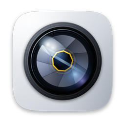

# Camera

**A camera for the Mac, wearing the iPhone's interface.**

Six capture modes · Screen recording · Photo and video editing · Saves to Photos

[Download the latest release](../../releases/latest) · macOS 14 or later · Apple silicon

---

## What it is

A replacement for Photo Booth. It puts the iPhone camera interface on macOS —
mode carousel, control cluster, filters, the lot — and adds the things a Mac
camera app actually needs: screen recording, an editor, and direct saving to
your Photos library.

Everything runs on your machine. **No account, no server, no network calls, no
telemetry.** The app has never made an outbound connection and does not contain
the code to make one.

## Capture modes

| Mode | What it does |
| --- | --- |
| **Photo** | Stills in HEIF or JPEG |
| **Video** | H.264 with audio |
| **Time Lapse** | Keeps one frame in *n* — 5×, 15×, 30× or 60× |
| **Slo-Mo** | Synthesised slow motion at 2×, 4× or 8× |
| **Portrait** | Subject separation with background blur |
| **Cinematic** | Portrait plus a focus pull between detected faces |

### About Portrait, Cinematic and Slo-Mo

These three are **software simulations**, and the app says so on screen rather
than letting the interface imply otherwise.

macOS gives an app no depth data at all: `AVCaptureDevice.Format`'s
`supportedDepthDataFormats` is marked `API_UNAVAILABLE(macos)` in the SDK. So
Portrait and Cinematic separate the subject with Vision person-segmentation and
blur what is left. It is a silhouette separation, not a distance one — a hand
held toward the camera blurs exactly as much as the shoulder behind it, and
fine hair against a busy background is where it shows.

Slo-Mo has the same honesty problem from the other direction. Most Mac webcams
cap at 30 fps, so there is no high-speed footage to slow down. The app
synthesises the in-between frames with optical flow, falls back to blending if
that is unavailable, and falls back again to a plain time-stretch rather than
producing something that looks broken. **It reports which method it used** after
every clip.

Anything the hardware cannot do — flash, depth capture, Night Mode — appears
in Settings under "Not available on this Mac", with the reason. Controls that
cannot work are dimmed and explain themselves rather than sitting there looking
live.

## Screen recording

Records the whole display, or **a single window** so everything else you do
stays out of the capture. System audio and cursor visibility are both
switchable. macOS shows its own recording indicator throughout — the app says
so on screen, because a screen recorder that hides itself is not one anybody
should trust.

When a recording finishes, the clip appears for a few seconds with an Edit
button, then clears itself.

## Editing

Non-destructive throughout. Every export writes a **new file**; the original is
never modified.

**Photos** — exposure, contrast, highlights, shadows, saturation, temperature,
tint, sharpness, vignette, eleven filters, crop with the usual aspect presets,
and quarter-turn rotation.

**Auto Enhance** measures the image — mean luminance, contrast spread,
saturation, clipped highlights and shadows — and derives adjustments from what
it finds rather than applying a fixed recipe. It tells you what it saw, and
tells an already-good photo that it is already good.

**Videos** — trim by time range, colour grade with the same controls, and clean
up the audio.

### Audio cleanup

Five stages: high-pass to remove rumble, downward expansion to lower the noise
floor between phrases, a presence lift around 3 kHz where consonants live, a
compressor to even out level, and a limiter.

Downward expansion rather than a noise gate, deliberately: a gate chops the
tails off words and sounds worse than the noise it removes.

## Profiles

Several people can share one Mac, each with their own settings, filters and
capture history. The owner profile gets an Admin tab showing the other profiles
and their capture counts.

**Admin never shows anyone else's photos.** That boundary is enforced by the
data model rather than by convention: the type the Admin view reads carries
counts and dates and no image data or file paths, so there is nothing there to
display even by mistake. Each person's captures go to their own Photos library,
which the app cannot read.

There is no password, no server and no network, so there is no credential store
to leak.

## Where captures go

Into your **Photos library**, in an album called Camera, plus a copy in the
app's own folder that the Library tab reads.

The app asks only for *add* permission — it never reads your existing photos.
If you decline, captures go to the folder alone and everything still works.

## Installing

Download the DMG from [Releases](../../releases/latest), open it, and drag
Camera to Applications.

**On first launch, right-click the app and choose Open**, then confirm.

macOS blocks apps that are not notarized by Apple, and notarization requires a
paid Apple Developer account this project does not have. The right-click step
is the standard one-time bypass; afterwards it opens normally. Nothing is wrong
with the download — you can verify its checksum against the one on the release
page.

The app will then ask for:

- **Camera** — to show a viewfinder and take photos
- **Microphone** — to record audio with video
- **Photos** — to add your captures to your library
- **Screen Recording** — only when you first use the Screen tab

## What it is built on

Apple frameworks only. **No third-party dependencies, no API keys, nothing to
sign up for.**

AVFoundation · ScreenCaptureKit · Core Image · Vision · Photos · SwiftUI ·
AppKit · Accelerate · ImageIO

## Troubleshooting

**"Camera access is off"** — grant it in System Settings › Privacy & Security ›
Camera.

**Screen tab says recording is off after enabling it** — ScreenCaptureKit reads
the permission when the process starts, so quit and reopen the app.

**Thumbnails will not load** — the Library reads the app's own capture folder.
If a file was moved or deleted outside the app, its thumbnail shows a
placeholder icon.

**Something else** — the app writes a startup trace to
`~/Library/Containers/com.yusufdiallo.camera/Data/Library/Logs/Camera-boot.log`.
Its last line is where things stopped. Include it if you report a problem.

## Known limits

- **Widgets are not shipped yet.** The code is written, but a widget extension
  needs a provisioning profile matching the host app, which needs a paid Apple
  Developer account.
- **Not notarized**, hence the right-click-to-open step.
- **Apple silicon only.** Adding Intel is a one-line change to the build script
  but has not been tested.

## Licence

Copyright © 2026 Yusuf Diallo. All rights reserved.

This software is distributed as a compiled application. The source is kept in a
private repository and is not licensed for redistribution or derivative works.
