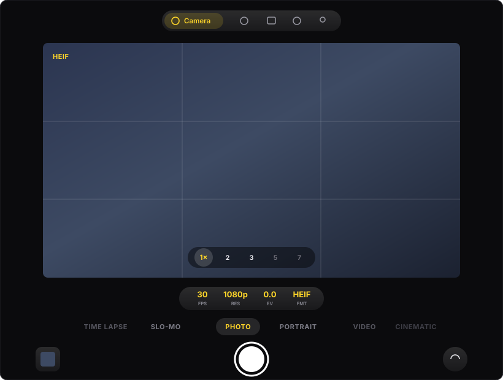
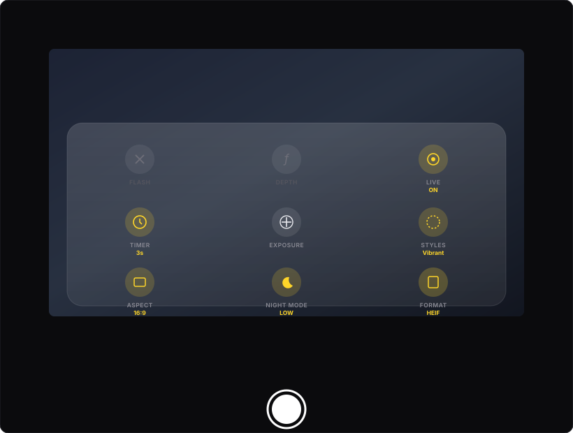
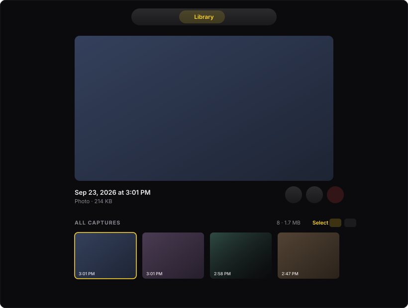

<div align="center">



<br><br>

```bash
brew install --cask yusufdiallo1/tap/aperture
```

<a href="https://github.com/yusufdiallo1/aperture/releases/latest"><b>Download the DMG</b></a>
&nbsp;&nbsp;·&nbsp;&nbsp;
<a href="docs/SETUP.md">Setup guide</a>

<sub>The cask clears the quarantine flag, so there is no right-click dance.</sub>

<br>


<br>

<table>
<tr>
<td width="25%" align="center"><b>Capture</b><br><sub>Six modes, iPhone interface</sub></td>
<td width="25%" align="center"><b>Record</b><br><sub>Screen or a single window</sub></td>
<td width="25%" align="center"><b>Edit</b><br><sub>Crop, grade, trim, clean audio</sub></td>
<td width="25%" align="center"><b>Keep</b><br><sub>Straight into Photos</sub></td>
</tr>
</table>

</div>

> **Downloads live here.** Aperture is closed source; the source is kept in a
> private repository, because GitHub will not serve a public download from
> one.

---

## Result

| | |
| --- | --- |
| **59** Swift files, **14,993** lines | no third-party dependencies |
| **381** engine tests | against real files, not mocks |
| **31** artifact checks | on every build |
| **10 MB** download | macOS 14+, Apple silicon |
| **1** outbound request | a daily version check you can switch off |

## Tech stack

Swift 5 and SwiftUI throughout, AppKit where SwiftUI cannot reach — the menu
bar item is an `NSStatusItem`, the countdown is an `NSPanel`, and the window
needs `fullSizeContentView` set by hand.

| Framework | What it does here |
| --- | --- |
| **AVFoundation** | Capture session, asset writing, trim and export |
| **Core Image** | Filters, styles, night mode, colour grading |
| **ScreenCaptureKit** | Screen and single-window recording |
| **Vision** | Face detection for the guide and Portrait's outline |
| **Photos** | Saving, Live Photo pairing, Recently Deleted and Hidden |
| **Combine** | Frame delivery from the capture queue to the preview |
| **WidgetKit** | Written, blocked on a paid developer account |
| **Carbon** | Global hotkeys, the one API that still does them |
| **Metal** | Backs the Core Image context |

No package manager, no build system beyond a shell script: `swiftc` compiles
the sources directly, `codesign` signs them, `hdiutil` makes the disk image.

## Problem

Photo Booth is the only camera app that ships with macOS and it has barely
changed in fifteen years: one mode, a fixed window, effects that look like
2007. Meanwhile the iPhone camera is one of the most refined interfaces Apple
makes — zoom pills you hold and drag, a shutter that slides into video, a mode
carousel — and none of it exists on the Mac. To take a decent photo with a Mac
you open a video-call app and screenshot yourself.

There is also a hardware gap nobody acknowledges. A Mac has no depth sensor,
most Mac cameras cap at 30 fps, and `videoFieldOfView` is unavailable on macOS
entirely. Apps that offer "Portrait mode" on a Mac are synthesising it and not
saying so.

## Solution

The iPhone camera interface, built natively for macOS, with the limits stated
rather than hidden.

Portrait and Cinematic are labelled SIMULATED, because the blur comes from a
detected outline rather than measured distance. Slo-Mo reports the frame rate
it actually achieved. Flash and Night Mode appear in Settings as unavailable,
with the reason, instead of being quietly dropped. The zoom dial shows what
each stop costs in pixels rather than inventing millimetres, because there is
no way to compute a focal length on this hardware.

## Process

Measurement over assumption, which has repeatedly changed the plan:

- Swapping `createCGImage` for an IOSurface render looked like an obvious
  speed-up. Measured: **1.82 ms against 3.86 ms** — the optimisation was
  twice as slow. Not done.
- The gallery scan looked like the cause of UI lag. Measured at 500 files:
  **2.6 ms**, under a single frame. Left alone. The real cause was 1.8 ms of
  Core Image work running on the main thread between every click and its
  effect.
- Crop appeared to work and did nothing: the writer's output size was pinned
  to the source's dimensions, so cropped frames were rendered into full-size
  buffers. There was no video-editing test at all, which is how it shipped.

Every fix gets a test, and every test is **sabotage-tested** — the bug is
reintroduced to confirm the test fails. That came from a real mistake: a
Slo-Mo fix was reported as correct when its test had passed by luck, and
repeated runs gave 21, 25, 33 and 45 frames.

The hardest bugs were the ones where the first diagnosis was wrong. The grey
strip above the viewfinder had two separate causes — a titlebar inset no
SwiftUI colour could reach, *and* navigation padding exposing a second
backdrop. Captures vanishing had one cause explaining four symptoms: they were
written to `.cachesDirectory`, which macOS purges, so the player, the trimmer
and the audio cleanup all had no file to read.

## What it is

A replacement for Photo Booth. It puts the iPhone camera interface on macOS —
mode carousel, control cluster, filters, the lot — and adds the things a Mac
camera app actually needs: screen recording, an editor, and direct saving to
your Photos library.

Everything runs on your machine. **No account, no server, no telemetry.** Your
captures, profiles and settings never leave the Mac, and nothing about how you
use the app is collected or transmitted.

There is exactly one outbound request: a daily check against a public GitHub
file to see whether a newer version exists. It sends no identifiers and nothing
about you, and **Settings → Check for updates** turns it off. That is the whole
of the app's network behaviour.

## At a glance

| | |
| --- | --- |
| **Six modes** | Photo · Video · Time Lapse · Slo-Mo · Portrait · Cinematic |
| **Burst** | Turn it on in the control sheet, then hold the shutter |
| **Live Photos** | A still plus the moment around it |
| **Screen** | Whole display or a single window, with system audio |
| **Effects** | 21 across five groups, live in the viewfinder |
| **Editing** | Crop, rotate, grade, trim, clean up speech — all non-destructive |
| **Storage** | Straight into Photos, add-only permission |
| **Profiles** | Several people per Mac, no server, no passwords |
| **Shortcuts** | ⌥⌘C to capture, ⌥⌘R for the recorder, from anywhere |
| **iPhone** | Use it as the camera over Continuity, when macOS offers it |
| **Appearance** | Light, dark, or follow the system — panels and all |
| **Timer** | 3, 5, 7, 10 or 15 seconds, counted down on screen |
| **Updates** | Checked daily, installed in place — no downloading or dragging |
| **Feedback** | Help › Report an Issue, with a screenshot, kept on your Mac |
| **Navigation** | Across the top, or a frosted pill you drag where you like |
| **Styles** | Five photographic styles, applied before any filter |
| **Night Mode** | Shadow recovery for a dim room, at two strengths |
| **Aspect** | 4:3, 16:9 or 1:1, matched by the viewfinder |
| **Zoom** | Stops at 1×, 2×, 4× and 8× — hold one and drag to slide between them |

> **Widgets are not in this build, and cannot be without a paid Apple
> Developer account.** macOS will not register a widget extension that has no
> Team Identifier, which only Apple issues. Every third-party widget that works
> on this Mac carries one; a self-signed build reports `not set`. A minimal
> twenty-line widget, signed locally, is never even launched — no crash report,
> no registration, nothing. See [Known limits](#known-limits).

## Screenshots

<p align="center">
  
</p>

<p align="center">
  
</p>

<p align="center">
  
</p>

## Capture modes

| Mode | What it does |
| --- | --- |
| **Photo** | Stills in HEIF or JPEG |
| **Video** | H.264 with audio |
| **Time Lapse** | Keeps one frame in *n* — 5×, 15×, 30× or 60× |
| **Slo-Mo** | Synthesised slow motion at 2×, 4× or 8× |
| **Portrait** | Subject separation with background blur |
| **Cinematic** | Portrait plus a focus pull between detected faces |

### Burst and Live Photos

**Hold the shutter** for a burst. A counter appears in the button and a ring
around it; release to keep the run. A hold shorter than a quarter second counts
as an ordinary tap, because holding the mouse down briefly is how people click.

The run then appears in the Library as a group — tap one frame to keep it and
discard the rest, or keep them all.

**Live Photos** save a still plus a short clip of the moment around it — the
window runs continuously, so the clip covers the seconds *before* the shutter as
well as after. Turn it on with the LIVE control or in Settings.

Apple's own Live Photo format pairs its two files through metadata that only
Photos writes. Rather than imitate that, Camera saves a still and a clip and
says that is what they are.

### About Portrait, Cinematic and Slo-Mo

These three are **software simulations**, and the app says so on screen rather
than letting the interface imply otherwise.

macOS gives an app no depth data at all: `AVCaptureDevice.Format`'s
`supportedDepthDataFormats` is marked `API_UNAVAILABLE(macos)` in the SDK. So
Portrait and Cinematic separate the subject with Vision person-segmentation and
blur what is left. It is a silhouette separation, not a distance one — a hand
held toward the camera blurs exactly as much as the shoulder behind it, and
fine hair against a busy background is where it shows.

Slo-Mo has the same honesty problem from the other direction. Most Mac webcams
cap at 30 fps, so there is no high-speed footage to slow down. The app
synthesises the in-between frames with optical flow, falls back to blending if
that is unavailable, and falls back again to a plain time-stretch rather than
producing something that looks broken. **It reports which method it used** after
every clip.

Anything the hardware cannot do — flash and depth capture — appears in
Settings under "Not available on this Mac", with the reason. Controls that
cannot work are dimmed and explain themselves rather than sitting there looking
live.

**Night Mode is synthesised**, the way Portrait and Slo-Mo are. macOS exposes
no low-light-boost API and no webcam offers a long exposure, so it cannot do
what an iPhone does — stack several exposures over a held second. What it does
instead is lift the shadows on a tone curve without touching the highlights,
clean up the noise that lifting reveals, and put a little saturation back so a
dim scene does not read grey. Off, LOW, HIGH, and the strength is on the
button. A real improvement in a dim room; nothing like a long exposure.

## Effects

Twenty-three creative effects, in Portrait and Cinematic:

| Group | Effects |
| --- | --- |
| **Multiply** | Army, Crowd, Kaleidoscope, Mirror |
| **Distort** | Bulge, Pinch, Twirl, Fisheye |
| **Stylize** | X-Ray, Comic, Edges, Posterize, Thermal, Night Vision |
| **Illustrated** | Soft Ink, Cartoon, Sketch, Watercolour |
| **Retro** | CRT, Halftone, Crystal, Pixels, Dream |

They appear live in the viewfinder, not only on the saved file, and they clear
themselves when you leave Portrait or Cinematic so an effect can never stay
applied somewhere you cannot switch it off.

**These are stylisations, not redrawings.** They flatten and outline the real
frame using smoothing, posterisation and edge detection. Turning a face into a
drawn character needs a trained neural model rather than a filter chain, and
this app does not ship one — so nothing here is named for a look it cannot
actually produce.

## The shutter

Tap it for one photo. **Hold and slide right** and it starts recording, the way
iOS does — you never leave the viewfinder to shoot a clip.

Holding on its own used to fire a burst, which meant one press produced ten
photos when you wanted one. Burst is still there, as a choice: turn it on in the
control sheet and holding gathers frames, with the count in the middle of the
shutter.

## Styles, aspect and zoom

**Photographic styles** are the tone the camera renders from, not a look laid
over a shot — the same distinction iOS draws. Standard, Rich Contrast, Vibrant,
Warm and Cool, applied *before* any filter so the two compose instead of
fighting. The button cycles them and shows which is active.

**Aspect** is 4:3, 16:9 or 1:1. The crop is centred, applied after zoom so the
two compose, and the viewfinder is held to the same ratio — what you frame is
what gets written.

**Zoom** has stops at 1×, 2×, 4× and 8×; hold one and drag to slide between
them. These are digital crops: a single fixed-focal-length webcam has no
optical zoom, and `.5×` is absent because cropping cannot widen a field of
view. Past the point where the sensor still has detail — derived from its real
width, not assumed — the long stops are drawn dimmer. They are offered because
framing a distant subject is sometimes worth the softness, not because the
detail is there.

## Screen recording

Records the whole display, or **a single window** so everything else you do
stays out of the capture. System audio and cursor visibility are both
switchable. macOS shows its own recording indicator throughout — the app says
so on screen, because a screen recorder that hides itself is not one anybody
should trust.

When a recording finishes, the clip appears for a few seconds with an Edit
button, then clears itself.

## Shortcuts

| | |
| --- | --- |
| `⌥⌘C` | Capture |
| `⌥⌘R` | Open the screen recorder |

Both work system-wide, without Camera in front. That matters most for screen
recording: stopping a recording by clicking back into the app puts that click in
the footage.

Switchable off in Settings › Shortcuts.

## Editing

Non-destructive throughout. Every export writes a **new file**; the original is
never modified.

**Photos** — exposure, contrast, highlights, shadows, saturation, temperature,
tint, sharpness, vignette, eleven filters, crop with the usual aspect presets,
and quarter-turn rotation.

**Auto Enhance** measures the image — mean luminance, contrast spread,
saturation, clipped highlights and shadows — and derives adjustments from what
it finds rather than applying a fixed recipe. It tells you what it saw, and
tells an already-good photo that it is already good.

**Videos** — trim by time range, colour grade with the same controls, and clean
up the audio.

**Batch export** — select several captures in the Library, apply one grade, and
write them wherever you choose. Existing files are never overwritten; a batch
that quietly replaces an earlier one is how work disappears.

**Framing aids** — a rule-of-thirds grid, a centre guide, and an optional box
around detected faces so you know you are in shot before the timer fires. The
timer ticks audibly, which matters when you are looking at the camera rather
than the screen.

### Audio cleanup

Five stages: high-pass to remove rumble, downward expansion to lower the noise
floor between phrases, a presence lift around 3 kHz where consonants live, a
compressor to even out level, and a limiter.

Downward expansion rather than a noise gate, deliberately: a gate chops the
tails off words and sounds worse than the noise it removes.

## Widgets

Three, in the desktop widget gallery. **Open Camera once first** — macOS only
registers a widget extension after its host app has run.

| Widget | Shows |
| --- | --- |
| **Shot Count** | How much you have captured; opens the camera |
| **Recent Captures** | Your latest thumbnails; opens the library |
| **Camera Modes** | Buttons that open a specific mode |

To add one: right-click the desktop → **Edit Widgets** → search **Camera**.

A widget cannot show a live viewfinder, and no app's can — macOS renders
widgets as still snapshots on a schedule rather than running views. These show
what you captured, not what the camera sees right now.

## Profiles

Several people can share one Mac, each with their own settings, filters and
capture history. The owner profile gets an Admin tab showing the other profiles
and their capture counts.

**Admin never shows anyone else's photos.** That boundary is enforced by the
data model rather than by convention: the type the Admin view reads carries
counts and dates and no image data or file paths, so there is nothing there to
display even by mistake. Each person's captures go to their own Photos library,
which the app cannot read.

There is no password and no server, so there is no credential store
to leak.

## Where captures go

Into your **Photos library**, in an album called Camera, plus a copy in the
app's own folder that the Library tab reads.

The app asks only for *add* permission — it never reads your existing photos.
If you decline, captures go to the folder alone and everything still works.

## Installing

Download the DMG from
**[aperture](https://github.com/yusufdiallo1/aperture/releases/latest)**,
open it, and drag Aperture to Applications.

### "Apple could not verify this is free of malware"

If you download the DMG with a browser you will see this:

> **"Aperture 1.7.dmg" Not Opened**
> Apple could not verify "Aperture 1.7.dmg" is free of malware that may harm
> your Mac or compromise your privacy.
> &nbsp;&nbsp; [ Move to Trash ] &nbsp; [ Done ]

**Click Done. Do not click Move to Trash.**

Nothing is wrong with the file. Aperture is not notarized — that requires a paid
Apple Developer account — so macOS refuses to verify it and says so in the
strongest wording it has. The same dialog appears for every un-notarized app.

You have two ways past it.

**The easy way — install with Homebrew instead, and none of this happens:**

```bash
brew install --cask yusufdiallo1/tap/aperture
```

The cask clears the quarantine flag as part of installing, so the app opens on
the first try.

**If you already downloaded the DMG,** open Terminal and run:

```
xattr -dr com.apple.quarantine ~/Downloads/Aperture*.dmg
```

Then double-click the DMG again. It will open normally.

### Letting the app open the first time

After dragging Aperture to Applications, the first launch may be blocked too.

1. Open **System Settings**
2. Click **Privacy & Security** in the left sidebar
3. Scroll down to the **Security** section
4. You will see: *"Aperture" was blocked to protect your Mac.*
5. Click **Open Anyway**
6. Enter your password or use Touch ID
7. Click **Open** in the dialog that follows

macOS remembers this. You only do it once.

An alternative that skips System Settings: find Aperture in Applications,
**right-click it and choose Open** (not a double-click), then click **Open** in
the dialog. Right-clicking is what makes macOS offer the choice at all.

The app then asks for camera, microphone and Photos access as it needs them,
and screen recording only when you first open the Screen tab.

**[Full setup guide →](docs/SETUP.md)** — every permission, what it is for, and
what to do when macOS keeps saying no.

## Building it yourself

```bash
./scripts/make-signing-cert.sh   # once
./scripts/build.sh               # builds build/Aperture.app
./scripts/make-dmg.sh            # builds dist/Camera-<version>.dmg
```

`make-signing-cert.sh` creates a local self-signed certificate. Without it the
app is signed ad-hoc, which leaves it with no stable identity — macOS then keys
privacy permissions to the code hash, and since that changes with every build,
you get asked for camera and screen access again after each one.

To sign with a real Developer ID, set two variables and the same scripts handle
it:

```bash
export DEVELOPER_ID="Developer ID Application: Your Name (TEAMID)"
export NOTARY_PROFILE="your-notarytool-profile"
./scripts/build.sh && ./scripts/make-dmg.sh
```

### Requirements

macOS 14+, Xcode 16+, Apple silicon. No package manager, no dependencies — the
build is `swiftc` straight to an app bundle.

## What it is built on

Apple frameworks only. **No third-party dependencies, no API keys, nothing to
sign up for.**

AVFoundation · ScreenCaptureKit · Core Image · Vision · Photos · SwiftUI ·
AppKit · Accelerate · ImageIO · WidgetKit

## Tests

```bash
./scripts/test.sh     # 192 engine tests against synthetic frames
./scripts/verify.sh   #  35 checks on the built artifacts
./scripts/e2e.sh      #  10 end to end against the live camera
```

The engine tests run the real encode paths rather than mocks, because the
failures worth catching here are the ones Core Image *traps* on rather than
throws — an infinite extent aborts the process, and no catch block saves it.

## Design notes

A few decisions that are not obvious from the outside:

**The app says what it cannot do.** Flash and depth capture appear in Settings
under "Not available on this Mac" with the reason, rather than being hidden
or — worse — shown as controls that quietly do nothing. Where something can be
approximated honestly rather than faked, it is: Portrait, Slo-Mo and Night Mode
are all synthesised, and each says so.

**A control that changes a value shows the value.** The timer, aspect, style,
format and exposure buttons print their current setting under the title. A
button that cycles through settings invisibly is indistinguishable from a
button that does nothing — which is exactly how the timer was reported.

**Mirroring is two settings.** A mirrored preview feels natural while you frame
a shot; a mirrored *file* has backwards text in it. They are separate switches
because most people want one and not the other.

**The admin tab cannot show anyone's photos.** Not by policy but by
construction: the type it reads carries counts and dates and no image data or
file paths, so there is nothing there to display even by mistake.

**Every export writes a new file.** An editor that overwrites the original
leaves you one mis-click from losing the shot.

**Time Lapse and Slo-Mo record no audio**, because their footage no longer
runs at real time and the sound would drift against the picture immediately.

## Troubleshooting

**"Camera access is off"** — macOS is holding the permission. To grant it:

1. Open **System Settings**
2. Click **Privacy & Security** in the left sidebar
3. Click **Camera**
4. Turn **Aperture** on

Microphone, Photos and Screen Recording live in the same place, each under its
own heading in that list. **Screen Recording is read once at launch**, so quit
and reopen Aperture after granting that one — the others take effect
immediately.

If you built the app yourself and macOS asks every single time, run
`scripts/make-signing-cert.sh`. Without a stable signing identity the
permission is keyed to a code hash that changes on every build.

**Screen tab says recording is off after enabling it** — ScreenCaptureKit reads
the permission when the process starts, so quit and reopen the app.

**Thumbnails will not load** — the Library reads the app's own capture folder.
If a file was moved or deleted outside the app, its thumbnail shows a
placeholder icon.

**Something else** — the app writes a startup trace to
`~/Library/Containers/com.yusufdiallo.aperture/Data/Library/Logs/Aperture-boot.log`.
Its last line is where things stopped.

## Known limits

- **Not notarized**, which is why macOS says it cannot verify the app and why
  the first launch needs Open Anyway. Notarization needs a paid Apple Developer
  account. Installing with Homebrew avoids the step entirely.
- **No widgets**, for the same reason. macOS refuses to register a widget
  extension without a Team Identifier, and only Apple issues those. This was
  established by elimination: the extension's version mismatch and its missing
  `CFBundleSupportedPlatforms` key were both real bugs and both fixed, and
  neither changed anything; a minimal `StaticConfiguration` widget with none of
  this project's code in it is refused identically. The widget code is written
  and builds with `BUILD_WIDGETS=1` for whenever that account exists.
- **Time Lapse and Slo-Mo record no audio.** Their footage no longer runs at
  real time, so real-time sound would drift against the picture immediately.
- **Apple silicon only.** Adding Intel is a one-line change to the build script
  but has not been tested.

## Licence

Copyright © 2026 Yusuf Diallo. All rights reserved.

This software is provided as a compiled application. The source is not
licensed for redistribution or derivative works.
